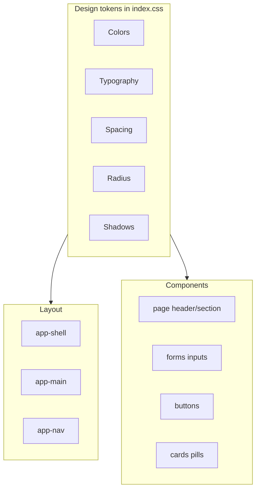

# PolyEdge Web App Design System

This document defines the design system for the PolyEdge web app. Use it as the single source of truth when implementing or updating any page UI. It ensures consistent spacing, colors, typography, and component behavior across the application.

---

## 1. Design Tokens

### Colors

All color usage must reference these tokens. Do not use hardcoded hex or rgba values in component styles.

| Token | Value | Use |
|-------|-------|-----|
| `--ink-900` | `#0f1f24` | Primary text, headings |
| `--ink-700` | `#31464c` | Body text, secondary content |
| `--ink-600` | `#3d565c` | Labels, progress text |
| `--ink-500` | `#5a7076` | Muted text, placeholders |
| `--ink-200` | `#a8b8bc` | Placeholder/default text in inputs |
| `--accent` | `#2a8f84` | Primary accent, links, buttons |
| `--accent-strong` | `#1f6f66` | Accent hover, active states |
| `--accent-warm` | `#d9924c` | Warm accent (decorative) |
| `--surface` | `rgba(255, 255, 255, 0.72)` | Semi-transparent surfaces |
| `--surface-strong` | `#ffffff` | Opaque white surfaces |
| `--outline` | `rgba(15, 31, 36, 0.14)` | Borders, dividers |
| `--color-success` | `#1fbf86` / `#0c6b4b` | Success states, status pills |
| `--color-error` | `#8f2e2e` / `rgba(217, 76, 76, ...)` | Error states, danger buttons |

**Accent tints for backgrounds:**
- Light accent: `rgba(42, 143, 132, 0.12)` (hover)
- Accent fill: `rgba(42, 143, 132, 0.15)` (pills, tags)
- Accent active: `rgba(42, 143, 132, 0.2)` (active nav, selection)

### Typography

| Token | Value | Use |
|-------|-------|-----|
| `--font-display` | `"Space Grotesk", "Sora", sans-serif` | Headings, brand |
| `--font-body` | `"Manrope", "Source Sans 3", sans-serif` | Body text, UI |
| `--font-mono` | `"IBM Plex Mono", ui-monospace, ...` | Code, paths, IDs |

**Type scale:**

| Token | Size | Use |
|-------|------|-----|
| `--text-xs` | `0.65rem` | Meta labels, file labels |
| `--text-sm` | `0.75rem` | Kickers, small labels |
| `--text-base` | `0.85rem` | Body text |
| `--text-md` | `0.9rem` | Field labels, form text |
| `--text-lg` | `0.95rem` | Nav links, emphasized text |
| `--text-xl` | `1rem` | Card titles |
| `--text-2xl` | `1.05rem` | Section headings |
| `--text-3xl` | `1.6rem` | Page titles |

**Font weights:** 300, 400, 500, 600, 700. Use 600 for labels and buttons, 700 for emphasis.

### Spacing (8pt grid)

| Token | Value | Use |
|-------|------|-----|
| `--space-1` | `0.25rem` | Tight gaps (4px) |
| `--space-2` | `0.5rem` | Inline gaps (8px) |
| `--space-3` | `0.75rem` | Small gaps (12px) |
| `--space-4` | `1rem` | Default gaps (16px) |
| `--space-5` | `1.2rem` | Medium gaps (20px) |
| `--space-6` | `1.4rem` | Section internal gaps |
| `--space-7` | `1.6rem` | Grid gaps |
| `--space-8` | `1.8rem` | Page section gaps |
| `--space-9` | `2rem` | Large section gaps |
| `--space-10` | `2.8rem` | Main content padding |
| `--space-11` | `3.2rem` | Nav/main horizontal padding |
| `--space-12` | `4rem` | Main bottom padding |

### Border Radius

| Token | Value | Use |
|-------|------|-----|
| `--radius-sm` | `6px` | Code snippets, small elements |
| `--radius-md` | `12px` | Inputs, checkboxes |
| `--radius-lg` | `14px` | Sections, command preview |
| `--radius-xl` | `16px` | Cards, meta blocks |
| `--radius-2xl` | `18px` | Large meta cards |
| `--radius-full` | `999px` | Pills, nav links, buttons |

### Shadows

| Token | Value | Use |
|-------|------|-----|
| `--shadow-soft` | `0 24px 60px rgba(15, 31, 36, 0.12)` | Hover elevation |
| `--shadow-card` | `0 14px 40px rgba(15, 31, 36, 0.08)` | Cards, modals |

---

## 2. Layout Rules

### Structure

```
app-shell (min-height: 100vh, flex column)
  app-nav (sticky, top)
  app-main (flex: 1, max-width: 1280px, margin: 0 auto)
    page content
```

- **Main content:** `padding: var(--space-7) var(--space-5) var(--space-8)` (horizontal padding now leans on the leanest tokens while preserving the token-based rhythm).
- **Section gaps:** Use `--space-8` (1.8rem) between major page sections.
- **Grid gaps:** Use `--space-7` (1.6rem) for two-column layouts.

### Breakpoints

| Breakpoint | Width | Use |
|------------|-------|-----|
| `sm` | `600px` | Nav padding, hide subtitle |
| `md` | `900px` | Stack grids, reduce padding |

### Token Flow



---

## 3. Component Patterns

### Page Wrapper

```html
<div class="page">
  <!-- page-header, sections, etc. -->
</div>
```

- `display: flex; flex-direction: column; gap: 1.8rem` (or `--space-8`)

### Page Header

| Class | Purpose |
|-------|---------|
| `.page-header` | Flex container: justify-between, gap 2rem, flex-wrap |
| `.page-kicker` | Uppercase, `--text-sm`, `letter-spacing: 0.18em`, `--ink-500` |
| `.page-title` | `--font-display`, `--text-3xl`, `--ink-900` |
| `.page-subtitle` | `--text-base`, `--ink-500`, max-width ~540px |

### Meta Card (right-side summary)

- Border: `1px solid var(--outline)`
- Radius: `--radius-xl` or `--radius-2xl`
- Background: `linear-gradient(140deg, rgba(255,255,255,0.95), rgba(226,242,240,0.7))`
- Padding: `1.1rem 1.4rem`
- Max-width: 280–320px

### Section Card (form sections, panels)

- Border: `1px solid var(--outline)`
- Radius: `--radius-lg`
- Background: `rgba(255, 255, 255, 0.75)`
- Padding: `0.9rem 1rem`
- Section heading: `--text-2xl`, uppercase, `letter-spacing: 0.12em`, `--ink-500`

### Forms

| Element | Class | Notes |
|---------|-------|-------|
| Field group | `.field` | `flex-direction: column`, gap 0.4rem |
| Label | `label` | `font-weight: 600`, `--text-md` |
| Input | `.input` | `border-radius: 12px`, `border: 1px solid var(--outline)`, `padding: 0.65rem 0.8rem` |
| Input readonly | `.input.readonly` | `background: rgba(255,255,255,0.6)`, `cursor: not-allowed` |
| Textarea | `.textarea` | `min-height: 120px`, `--font-mono`, `--text-base` |
| Checkbox | `.checkbox` | Flex, gap 0.5rem, `--text-md` |
| Fields grid | `.fields-grid` | `grid-template-columns: repeat(auto-fit, minmax(190px, 1fr))`, gap 0.9rem |

### Buttons

| Variant | Class | Use |
|---------|-------|-----|
| Default | `.button` | Secondary actions |
| Primary | `.button.primary` | Main CTA |
| Ghost | `.button.ghost` | Low emphasis |
| Danger | `.button.danger` | Destructive actions |

- Padding: `0.7rem 1.4rem`
- Radius: `--radius-full`
- Hover: `transform: translateY(-1px)`, `box-shadow: var(--shadow-soft)`

### Status Pills

| Class | Use |
|-------|-----|
| `.status-pill` | Base: inline-flex, padding, uppercase, letter-spacing |
| `.status-pill.success` | Green tint |
| `.status-pill.failed` | Red tint |
| `.status-pill.running` | Accent tint |

### Command / Code Blocks

- `.command-preview`: `border: 1px dashed var(--outline)`, `--radius-lg`, `--font-mono`, `--text-sm`
- Inline `code`: `--font-mono`, `--text-sm`, `background: rgba(255,255,255,0.8)`, `padding: 0.1rem 0.3rem`, `border-radius: 6px`

### Tables

- `.table-container`: Border, radius 14px, overflow auto, max-height 320px
- `.preview-table`: `font-size: 0.78rem`, sticky header, `border-collapse: collapse`
- Cell padding: `0.5rem 0.6rem`

### Logs

- `.log-tabs`: Flex gap, wrap
- `.log-tab`: Pill style; `.log-tab.active` uses accent background
- `.log-block`: `--font-mono`, `--text-sm`, `max-height: 240px`, overflow auto

---

## 4. LLM Instructions

When implementing or updating a page UI, follow these rules:

1. **Always use design tokens.** Do not hardcode colors (hex, rgba), spacing (rem/px), or font sizes. Reference tokens from this document.

2. **Follow page structure.** Use `app-shell` > `app-main` for layout. Wrap page content in a `.page`-style container with consistent section gaps.

3. **Use component patterns.** Reuse the patterns defined above (page header, meta card, section card, forms, buttons, status pills, etc.). Match class names and structure.

4. **Add missing tokens if needed.** If you introduce a new value, add it to the token sections and use it consistently. Prefer extending the scale over one-off values.

5. **Responsive behavior.** Use breakpoints 600px and 900px. Stack grids at 900px. Reduce padding at smaller widths. Avoid fixed pixel widths for content.

6. **Accessibility.** Ensure sufficient contrast (ink-900/700 on light backgrounds). Use semantic HTML. Do not rely on color alone for status.

---

## 5. Quick Reference

| Use case | Token or value |
|----------|----------------|
| Page title | `--font-display`, `--text-3xl`, `--ink-900` |
| Body text | `--font-body`, `--text-base`, `--ink-700` |
| Muted text | `--ink-500` |
| Kicker / label | `--text-sm`, `--ink-500`, uppercase |
| Primary button | `.button.primary` |
| Section gap | `--space-8` (1.8rem) |
| Grid gap | `--space-7` (1.6rem) |
| Card radius | `--radius-lg` (14px) |
| Input radius | `--radius-md` (12px) |
| Border | `1px solid var(--outline)` |
| Success color | `--color-success` or green tint |
| Error color | `--color-error` or red tint |
